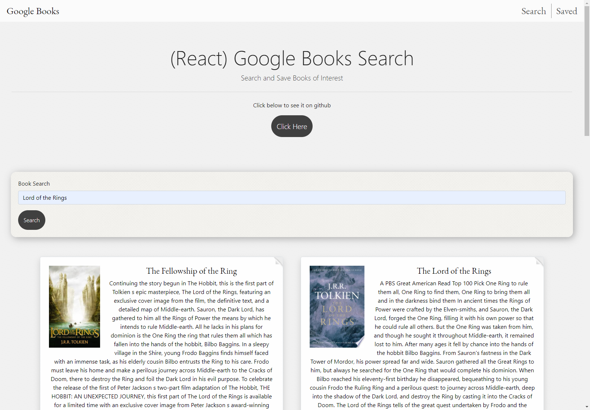

# Google-Books-Search

## Overview
This app was built with React. 
 
Users can search for a book title to get results from the Google books api. 
 
Save and delete books.

## Instructions
[Visit this link to try](https://starr-google-books.herokuapp.com)
 

### To Use
Search for a book to start!

 
## Built With
* node.js
* JavaScript
* HTML
* CSS
* [Bootstrap 4](https://getbootstrap.com/)-for CSS library
* [Create React App](https://github.com/facebook/create-react-app)-for React
* [express from npm](https://www.npmjs.com/package/express)
* [axios](https://www.npmjs.com/package/axios)-for HTTP requests from node
* [react-toastr](https://tomchentw.github.io/react-toastr/)-for notifications
* [mongoose](https://www.npmjs.com/package/mongoose)-for database
* [animate.css](https://daneden.github.io/animate.css/)-for animations and react-toastr

## Author
* Kayleigh Starr